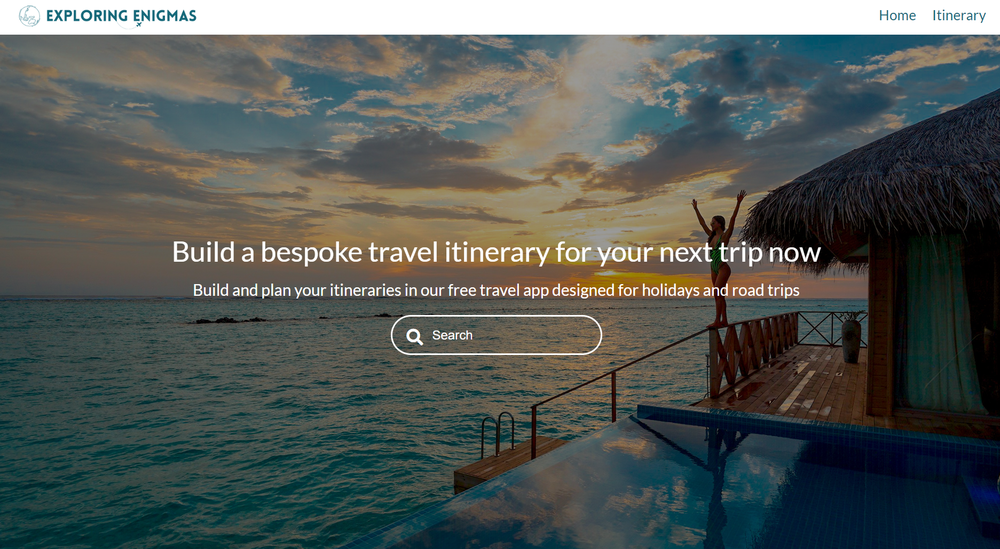

# Exploring-Enigmas

> A travel app that allows the user to search a particular area which will return nearby points of interest and hotels. Including an itinerary page for planning their day which persists on page reload/refresh using local storage.

## Table of contents

- [General info](#general-info)
- [Screenshots](#screenshots)
- [Technologies](#technologies)
- [Setup](#setup)
- [Live Application](#live-application)
- [Features](#features)
- [Status](#status)
- [Contact](#contact)

## General info

A group project to practise collaboration on GitHub, Agile development, React and deploying an application.

## Screenshots

## Technologies

- HTML
- CSS
- JavaScript
- React
- React Router
- Node
- Axios
- Hotels API
- Open Trip Map API

## Setup

Open the live application link in any modern browser.

## Live Application

https://63f64f6e24551b0a4c28711d--exploring-enigmas.netlify.app/

## Features

List of features ready and TODOs for future development

- Search for a location.
- Returns points of interest on a map and nearby hotels.
- Itinerary page which saves/retrieves user inputs to local storage.

To-do list:

- Use Bootstrap cards to display the hotel information.
- Add a route planner from the hotels to a selected point of interest.

## Status

Project is: _in progress_

## Contact

zaraaitken18@gmail.com - feel free to contact me!
